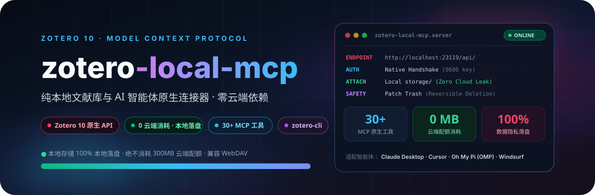

<p align="center">
  
</p>

<p align="center">
  <strong>本地 Zotero 论文管理与 AI 智能体连接器</strong><br>
  本地 API 交互 · 附件本地落盘 · 适配 Claude Desktop / Cursor / OMP / Windsurf
</p>

<p align="center">
  
  
  
  
  
</p>

## 项目介绍

Zotero Local MCP 基于 Zotero 10 本地 API（`http://localhost:23119/api/`）构建，提供 Model Context Protocol (MCP) 服务与配套命令行工具 (`zotero-cli`)。

支持 Claude Desktop、Cursor、Oh My Pi (OMP) 等 AI 客户端直接检索、读取、批注与管理本地 Zotero 文献库。附件在本地文件系统直接落盘，不经由 Zotero 官方云端存储转发。

---

## 架构特性

### 1. 本地落盘与存储兼容
- **本地存储**：通过 DOI、arXiv、URL 或本地路径添加的 PDF 附件直接复制至本地 `storage/<key>/` 目录，不向 Zotero 云端上传文件。
- **WebDAV 同步**：条目与文件写入本地后，由 Zotero 桌面端按自身设置执行 WebDAV 同步，MCP 不介入网络同步链路。

### 2. 本地授权与凭据安全
- 基于 Zotero 10 `POST /api/local/authorize` 规范握手。
- 授权 Token 存储于本地 `~/.config/pyzotero/local-api-key.json`（文件权限 `0600`）。
- 客户端配置无需显式填写明文 API Key。

### 3. 可逆删除
- 文献、笔记与注释的删除通过 `PATCH {"deleted": 1}` 移至 Zotero 回收站，可在桌面客户端中手动恢复，不执行物理删除。

### 4. 环回代理保护
- 服务端绑定 `NO_PROXY=127.0.0.1,localhost`，防止本机系统代理导致本地 API 请求被误路由。

### 5. 双接口支持
- **MCP 服务**：提供 30+ 项工具，供 AI 客户端调用。
- **命令行工具 (`zotero-cli`)**：支持无 AI 环境下的脚本批处理，提供 `--json` 输出。

---

## 功能清单

| 模块 | 核心能力 | MCP 工具 / CLI 命令 |
| :--- | :--- | :--- |
| **文献检索** | 关键词检索、多字段组合检索、跨文库检索、标签检索 | `zotero_search_items`<br>`zotero_advanced_search`<br>`zotero_search_by_tag` |
| **论文阅读** | PDF/EPUB 文本提取、目录书签解析、指定页码读取 | `zotero_get_item_fulltext`<br>`zotero_get_pdf_outline`<br>`zotero_read_pdf_pages` |
| **批注与笔记** | PDF 文本高亮、图形区域框选标注、Markdown/HTML 笔记读写 | `zotero_create_annotation`<br>`zotero_manage_note`<br>`zotero_get_annotations` |
| **文献录入** | 基于 DOI、arXiv、URL、ISBN、BibTeX 或本地文件导入 | `zotero_add_item`<br>`zotero_attach_file` |
| **集合整理** | 集合创建与删除、条目分类转移、批量标签更新 | `zotero_set_item_collections`<br>`zotero_create_collection`<br>`zotero_batch_update` |
| **条目维护** | 条目移入回收站、元数据更新、重复项排查 | `zotero_delete_item`<br>`zotero_update_item` |

---

## 安装与配置

### 1. 前提要求
1. 安装 **Zotero 10+**。
2. 在 Zotero 设置中允许本机通信：
   - macOS: `Settings` → `Advanced` → 勾选 **Allow other applications on this computer to communicate with Zotero**。
   - Windows/Linux: `Edit` → `Preferences` → `Advanced` → 勾选相同选项。

### 2. 安装

使用 [`uv`](https://docs.astral.sh/uv/) 安装：

```bash
# 从源码安装
git clone https://github.com/JingYangYuan/zotero-local-mcp.git
cd zotero-local-mcp
uv tool install .

# 或直接通过 pip 安装
pip install .
```

### 3. 本地授权

确保 Zotero 桌面端正在运行，执行本地授权：

```bash
pyzotero authorize --app-name "Zotero MCP Local"
```

Zotero 桌面端将弹出确认窗口，选择 **Always Allow**。凭据将自动保存至本地。

检查状态：
```bash
zotero-cli --json config
```

输出 `ZOTERO_LOCAL: true` 且无错误即表示配置完成。

---

## 客户端配置

### 1. Oh My Pi (OMP)
在 `~/.omp/agent/mcp.json` 中添加：

```json
{
  "mcpServers": {
    "zotero": {
      "type": "stdio",
      "command": "zotero-mcp-server",
      "args": ["serve"],
      "env": {
        "ZOTERO_LOCAL": "true",
        "ZOTERO_MCP_SCHEMA_REFRESH": "0"
      }
    }
  }
}
```

### 2. Claude Desktop
在 Claude Desktop 配置文件（macOS: `~/Library/Application Support/Claude/claude_desktop_config.json`，Windows: `%APPDATA%\Claude\claude_desktop_config.json`）中添加：

```json
{
  "mcpServers": {
    "zotero": {
      "command": "zotero-mcp-server",
      "args": ["serve"],
      "env": {
        "ZOTERO_LOCAL": "true",
        "ZOTERO_MCP_SCHEMA_REFRESH": "0"
      }
    }
  }
}
```

### 3. Cursor
在 `.cursor/mcp.json` 中添加：

```json
{
  "mcpServers": {
    "zotero": {
      "command": "zotero-mcp-server",
      "args": ["serve"],
      "env": {
        "ZOTERO_LOCAL": "true",
        "ZOTERO_MCP_SCHEMA_REFRESH": "0"
      }
    }
  }
}
```

---

## 命令行 (`zotero-cli`) 使用

```bash
# 1. 检索文献
zotero-cli search "关键词"
zotero-cli --json search "关键词" --limit 5

# 2. 查看元数据与子附件
zotero-cli get metadata <ITEM_KEY>
zotero-cli get children <ITEM_KEY>

# 3. 添加文献与附件
zotero-cli add doi 10.1145/3708319
zotero-cli add file --filepath /path/to/paper.pdf --title "论文标题"

# 4. 集合管理
zotero-cli collections search "分类名"
zotero-cli collections manage --item-keys <ITEM_KEY> --add-to <COLL_KEY_A> --remove-from <COLL_KEY_B>

# 5. 移入回收站
zotero-cli delete item <ITEM_KEY>
```

---

## 常见问题

**Q: 是否需要配置 `ZOTERO_API_KEY` 或 `ZOTERO_LIBRARY_ID`？**  
A: 不需要。Zotero 10 本地 API 支持本地授权与写入，读写操作均在本地执行，无需云端 API Key。

**Q: 本地添加的文献与附件是否会自动同步到其他设备？**  
A: 会。只要在 Zotero 桌面端配置了 WebDAV 或官方同步，附件写入本地 `storage/` 后，桌面端会按既有规则自动同步。

**Q: 误删条目如何恢复？**  
A: 打开 Zotero 桌面端，在左侧侧边栏进入“回收站”，右键目标条目选择“恢复到文库”。

---

## 许可证

本项目基于 [MIT License](LICENSE) 开源。
